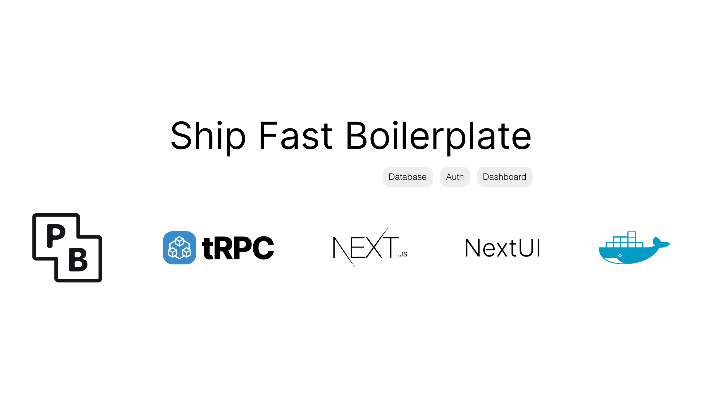

# Ship Fast Boilerplate

Welcome to the Ship Fast Boilerplate! This open-source project is designed to help developers quickly set up a modern web application with essential features like a database, authentication, and a dashboard.

## What's Inside?

This boilerplate includes the following tools and technologies:

- **PocketBase (PB)**: An open-source backend featuring real-time database, authentication, and file storage.
- **tRPC**: A framework for building end-to-end typesafe APIs, ensuring seamless communication between your client and server.
- **Next.js**: A powerful React framework for building server-side rendered applications with ease.
- **NextUI**: A modern and highly customizable React UI library.
- **Docker**: Containerization platform to streamline the development and deployment processes.

## Features

- **Database**: Integrated with PocketBase for real-time data management.
- **Authentication**: Secure user authentication out of the box.
- **Dashboard**: A ready-to-use admin dashboard for managing your application.

## Repository Contents

- frontend (Next.js)
  - Dockerfile
- pocketbase
  - Dockerfile

## Getting Started

Each directory has its own Dockerfile, so you can build and run them separately or make your own docker-compose file.

### Pocketbase

After launching the PocketBase container, you can access the PocketBase admin panel at `http://localhost:8090/_`. 
#### For the first time, you will see the admin setup page.
Use the created email & password in `frontend/.env` file (check .env.example).

## Contributing

Contributions are welcome! Please feel free to submit a Pull Request.

## Credits

Created by [Amirreza Salimi](https://github.com/amirrezasalimi).

## License

This project is licensed under the MIT License. See the [LICENSE](LICENSE) file for more details.
